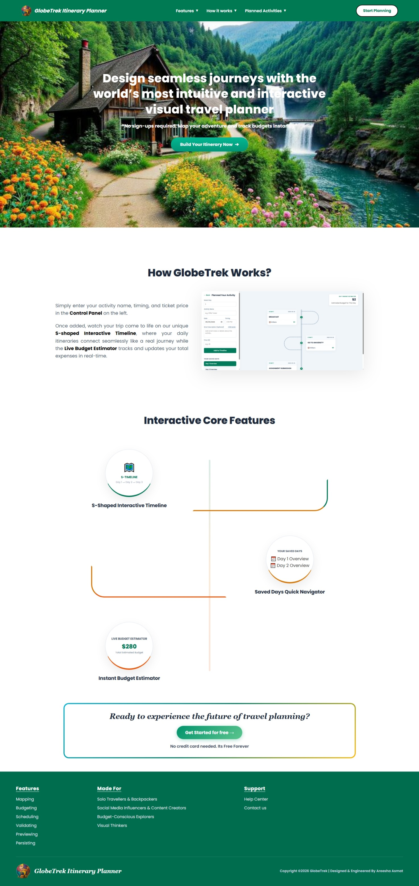
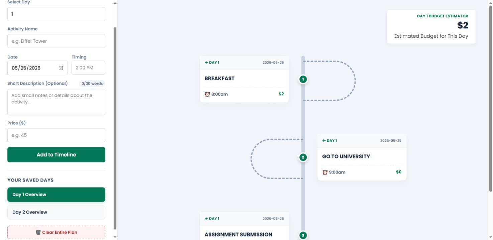
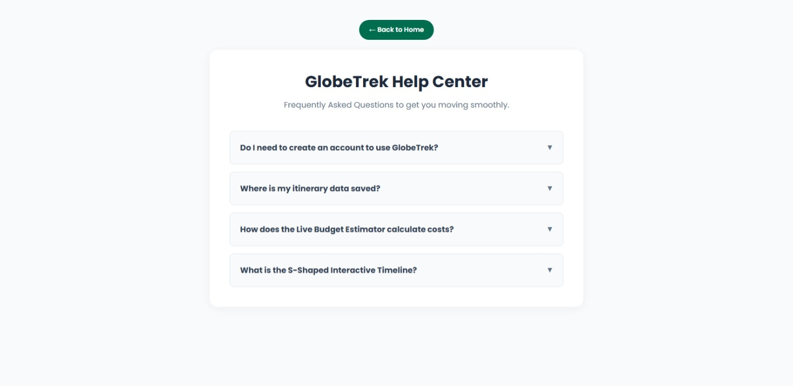
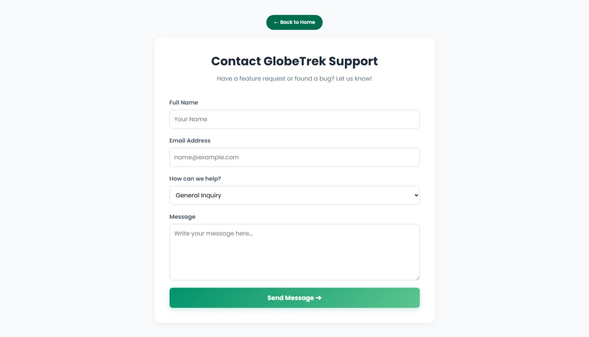

# 🗺️ GlobeTrek — Travel Planning Application

GlobeTrek is a modern, user-friendly travel planning application designed to help users map out, organize, and manage their journeys seamlessly. Built with a focus on smooth user experience, it operates fully without user authentication for instant, hassle-free accessibility.

---

## 🚀 Key Features

- **Authentication-Free Access:** No login or signup required; start planning your trip instantly.
- **Interactive Travel Planner:** Features an intuitive interface to organize itineraries and schedules smoothly.
- **Responsive Layout:** Pixel-perfect design optimized for both desktop and mobile views.
- **Modular Architecture:** Developed using clean component structures and scalable state management.

---

## 📸 Screenshots & Demo

### 🎥 Project Demo Video

https://github.com/user-attachments/assets/1cdec133-621c-43cc-898f-6cf5194a6c49

### 🖼️ Application Interface

#### 🌐 Main Landing Page

  

#### 📁 Application Sections

  

  
  

---

## 🛠️ Tech Stack

- **Frontend:** React.js, Vite
- **Styling:** Standard CSS (Modular and clean layout architecture)
- **State Management:** React Context API / Hooks

---
